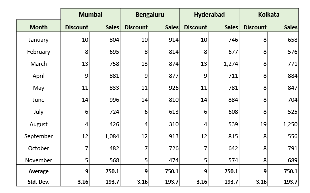
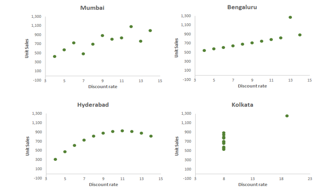

# python-data-visualization
Data Visualization

###`Why Visualization is important ?`

below example shows each of the branches had similar average sales and discount rates, 
and the corresponding standard deviations were similar as well, as shown
in the table below.

However, the patterns in the underlying data and the difference became apparent when visualised through appropriate plots.

Mumbai sales shoot up with increasing discount, then goes a little down and then up/
Over all up

For Bangalore, sales increases with discount with 1 exception

For Hyderabad , it starts to fall down post a thresh hold discount

For Kolkata, irrespective of discount sale is increasing

